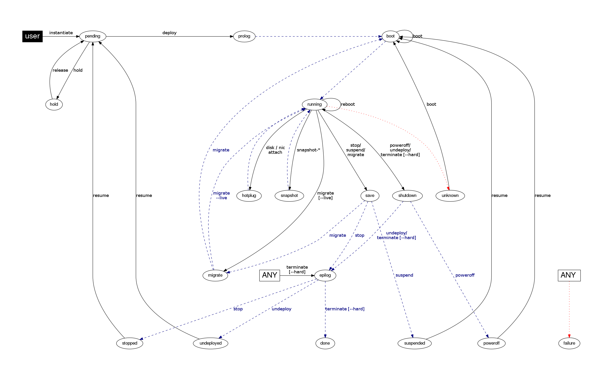
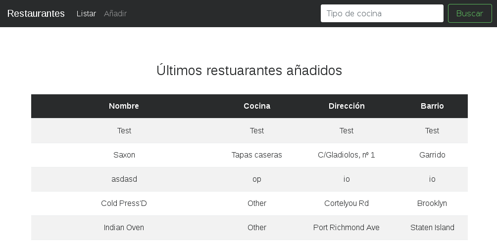
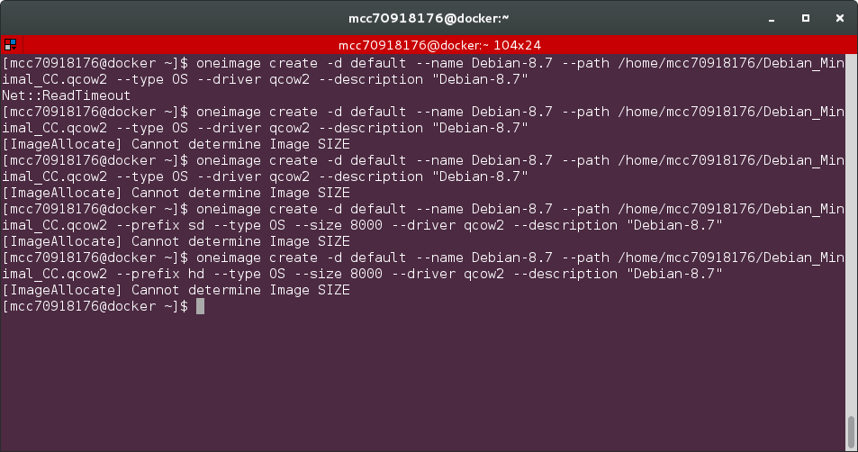

# Práctica 1: IaaS
> Aythami Estévez Olivas <aythae@correo.ugr.es>
>
> Cloud Computing: Servicios y Aplicaciones.
>
> Departamento de Ciencias de la Computación e Inteligencia Artificial
>
>Universidad de Granada

## Enunciado de la práctica
El objetivo de esta práctica es familiarizarse con el uso de una plataforma IaaS y desarrollar habilidades de despliegue de máquinas virtuales y aplicaciones web sencillas. La plataforma IaaS a utilizar será [OpenNebula](https://opennebula.org/), una plataforma de software libre que permite la creación de plataformas cloud.

Para llevar a cabo esta práctica he realizado las siguientes tareas:
  1. Crear dos MVs, cada una con una distribución de Linux.
      1. En la primera instalar y configurar un servidor web.
      2. En la segunda instalar y configurar un SGBD
  2.  Desarrollar una aplicación web sencilla alojada en la MV1, que use una BD manejada por el SGBD instalado en la MV2. La aplicación web incluye el uso de formularios, la consulta y modificación de los datos almacenados en la BD
  3.  Realizar el despliegue de ambas MVs para evaluar el funcionamiento de la aplicación.

## Uso de OpenNebula y creación de MVs
Para acceder a OpenNebula se ha habilitado el acceso por ssh al host docker.ugr.es, teniendo creado cada alumno un usuario de la siguiente forma mccNumDNI.

```
ssh mccDNI@docker.ugr.es
```

Tras introducir la contraseña es necesario iniciar sesión en OpenNebula, esto hay que hacerlo si hace más de 12 horas que hemos iniciado sesión, ya que pasado ese tiempo esta caduca y no es posible ejecutar comandos de OpenNebula. Para realizar esta acción hay que introducir el comando:

```
oneuser login $USER --ssh –force
```

El uso de la variable de entorno `$USER` hace que no resulte necesario introducir el nombre de usuario y que este comando se pueda emplear por cualquier usuario.

Una vez iniciada sesión ya se pueden ejecutar los comandos de OpenNebula (que comienzan por one...), además se genera una contraseña, válida mientras dure la sesión, que se puede encontrar en el fichero `~/.one/one_auth` de la siguiente forma: `mcc<DNI>:Contraseña` y sirve para acceder a la interfaz web OpenNebula Sunstone disponible en [http://docker.ugr.es:9869/](http://docker.ugr.es:9869/) que permite realizar prácticamente las mismas funciones que con los comandos en la CLI de una manera gráfica. Personalmente soy mas partidario del uso de comandos ya que resulta más flexible y probablemente se encuentren disponibles aún en caso de que la interfaz web no funcione adecuadamente.

El proceso de creación de MVs conlleva varios pasos, lo primero es necesario crear una plantilla (template) en la que definimos las características de la MV (CPUs, RAM, Red...) para ello ejecuto el siguiente comando que explicaré a continuación:
```
onetemplate create --name "Plantilla_CentOS_7" --cpu 1 --vcpu 1 --memory 1024 --arch x86_64 --disk 9 --nic "mccDNI_vnet" --vnc --ssh --net_context
```

- --cpu: Porcentaje de CPU limitado para la máquina (1=100%)
- --vcpu: Número de CPUs virtuales
- --memory: Memoria RAM en MB
- --arch: Arquitectura de la MV
- --disk: ID del disco/imagen a utilizar, que básicamente es un disco duro virtual con un SO instalado, se pueden consultar las imágenes disponibles con oneimage list
- --nic: Red virtual que usará. Todos los usuarios tenemos creada una red virtual y esta se puede consultar con onevnet list | grep $USER
- --vnc: Añade un servidor VNC a la MV
- --ssh: Habilita el acceso por SSH
- --net_context: Utiliza el contexto de la imagen

Una vez hecho esto podemos instanciar una MV a partir de dicha plantilla con:
```
onetemplate instantiate <ID> --name NombreMV
```

Donde el ID corresponde al de la plantilla deseada, que puede ser consultado con `onetemplate list`.

Una vez se crea la maquina por una serie de estados hasta llegar al estado _running_ en el que se puede utilizar, el siguiente diagrama de estados recoge los posibles estados de una MV y como pasar de uno a otro mediante el comando `onevm` (p.e. `onevm poweroff` pasa del estado _running_ a _shutdown_)



Podemos consultar el estado de una MV con el comando

```
onevm list
```

Una vez la maquina virtual se encuentre en estado running accedemos a ella con

```
ssh root@<IP>
```

Donde IP es la IP de la MV, la cual se puede consultar con `onevm show <id_maquina_virtual>`, en concreto el campo ETHO_IP dentro de CONTEXT.
Una vez dentro de la MV es recomendable actualizarla, para ello hay que ejecutar (en mi caso que la MV tiene un SO CentOS 7):
```
yum -y update
```


## Configuración de la MV1: Servidor SGBD
Como base para la MV que albergará el SGBD he usado la plantilla de CentOS 7 creada en el apartado previo. Como SGBD he decidido instalar MongoDB ya que la aplicación utilizada para esta práctica procede de otra asignatura y usaba ese SGBD.

### Instalación del SGBD
Con la máquina instanciada y actualizada seguiré las siguientes [instrucciones](https://docs.mongodb.com/manual/tutorial/install-mongodb-on-red-hat/) instalando la ultima versión estable disponible de MongoDB para esta plataforma. Para ello es necesario crear el fichero `/etc/yum.repos.d/mongodb-org-3.4.repo` para añadir el repositorio de mongodb a yum:

```
[mongodb-org-3.4]
name=MongoDB Repository
baseurl=https://repo.mongodb.org/yum/redhat/$releasever/mongodb-org/3.4/x86_64/
gpgcheck=1
enabled=1
gpgkey=https://www.mongodb.org/static/pgp/server-3.4.asc
```

Tras esto actualizar con `yum update`

Instalo el paquete `mongodb-org`, un metapaquete que incluye todas las herramientas recomendadas por MongoDB con el comando

```
yum install -y mongodb-org
```

Una vez instalado arrancamos el daemon de mongodb con

```
systemctl start mongod
```

y lo activamos para que arranque al inicio del sistema con

```
systemctl enable mongod
```

### Creación de la BD para la aplicación
Usaré una BD para la aplicación dada por [MongoDB como ejemplo](https://docs.mongodb.com/getting-started/shell/import-data/), dicha base de datos es una BD de restaurantes con diversos campos. Para cargar los datos de dicha base de datos hay que seguir los pasos que se indican en el siguiente enlace https://docs.mongodb.com/getting-started/shell/import-data/. Descargando el fichero `primer-dataset.json` con

```
curl -O https://raw.githubusercontent.com/mongodb/docs-assets/primer-dataset/primer-dataset.json
```

e importándola con:

```
mongoimport --db test --collection restaurants --drop --file primer-dataset.json
```

### Configuración para la conexión desde la otra MV
A continuación ha que tocar el fichero `/etc/mongod.conf` para permitir conexiones de la interfaz LAN, ya que por defecto MongoDB solo admite conexiones desde localhost, para realizar esto hay que modificar el parámetro `bind_ip` de la opción `net` de dicho fichero añadiéndole la IP de dicha interfaz como se puede ver:
```
...
net:
  port: 27017
  bindIp: 127.0.0.1,192.168.10.72
...
```

### Habilitar conexión con el exterior
Es necesario también abrir el puerto que usa MongoDB por defecto, el 27017. Para ello he usado el comando, para ello hay que usar el comando `firewall-cmd` como se indica en  esta [página](http://ask.xmodulo.com/open-port-firewall-centos-rhel.html).

```
firewall-cmd --zone=public --add-port=27017/tcp --permanent
firewall-cmd --reload
```

## Servidor web
En este caso creo una MV usando como plantilla la creada de CentOS-7 como en el caso previo, ya que lo he intentado en Ubuntu 14.04 y he tenido múltiples problemas como que no funcione la interfaz de red loopback.

### Instalación del servidor web
He decidido instalar el servidor web Nginx siguiendo este [tutorial](https://www.digitalocean.com/community/tutorials/how-to-install-nginx-on-centos-7), es necesario añadir el repositorio [Extra Packages for Enterprise Linux (EPEL)](https://fedoraproject.org/wiki/EPEL) ejecutando el siguiente comando:

```
yum -y install epel-release
```

Una vez echo esto podemos instalar nginx con

```
yum -y install nginx
```

Para arrancarlo y habilitar que se arranque automáticamente con la máquina usamos el comando:

```
systemctl start nginx && systemctl enable nginx
```

### Habilitar conexión con el exterior
Es necesario abrir el puerto 80, ya que a diferencia de Ubuntu, en esta imagen de CentOS no se encuentra abierto, para ello hay que usar el comando `firewall-cmd` como se indica en  esta [página](http://ask.xmodulo.com/open-port-firewall-centos-rhel.html).

```
firewall-cmd --zone=public --add-port=80/tcp --permanent
firewall-cmd --reload
```

### Insalación de los componentes necesarios para la aplicación
La aplicación web se ha creado usando Python 3 así que es necesario instalar los paquetes necesarios para el desarrollo en python:

```
yum -y install python34 python34-pip git
pip3 install virtualenv
```

Tras esto descargar el repositorio de GitHub donde se encuentra la aplicación en el directorio `/home` con

```
cd /home
git clone https://github.com/AythaE/SSBW.git
```

Acceder al directorio de la aplicación `cd SSBW/T4` y activar el entorno virtual para controlar las dependencias de python de manera correcta:

```
virtualenv -p $(which python3) .
source bin/activate
```

Una vez hecho esto instalamos los módulos de python necesarios:

```
pip install  pymongo==2.8 mongoengine django
```

Cabe mencionar que instalo pymongo en su versión 2.8 (obsoleta) debido a un [bug encontrado](http://stackoverflow.com/a/31164662) con la ultima versión que hace que salte un error al conectarse a la base de datos.

### Habilitar comunicación entre Nginx y Django
Esto se realizará utilizando la interfaz estándar de Python Web Server Gateway Interface (WSGI) en su implementación uWSGI. He seguido las [el tutorial de DigitalOcean para comunicar Nginx y una aplicación Django](https://www.digitalocean.com/community/tutorials/how-to-serve-django-applications-with-uwsgi-and-nginx-on-centos-7#setting-up-the-uwsgi-application-server) así como el [tutorial oficial de uWSGI](http://uwsgi-docs.readthedocs.io/en/latest/tutorials/Django_and_nginx.html). Para instalar el paquete de python necesario hay que asegurarse de que estén instalados los siguientes paquetes

```
yum install python34-devel gcc
```

y ejecutar el siguiente comando con el entorno virtual desactivado para que se instale en todo el sistema, ya que una vez configurado hare que se ejecute como servicio de manera en el arranque

```
deactivate # Para desactivar el entorno virtual si está activado
pip3 install uwsgi
```

La ejecución del contenedor uWSGI se puede realizar con el comando del mismo nombre, pero teniendo en cuenta que lleva un elevado numero de parámetros lo mejor es crear un fichero de configuración con dichos parámetros y pasárselo al comando, para ello creo el directorio `/etc/uwsgi/sites` que almacenara los ficheros de cada uno de los sitios (en este caso solo uno)

```
mkdir -p /etc/uwsgi/sites
cd /etc/uwsgi/sites
vi app.ini
```

Dicho fichero contendrá lo siguiente

```
[uwsgi]
#Variables
project = app
base = /home/SSBW/T4

#Directorio base del projecto
chdir = %(base)/%(project)
#Directorio del entorno virtual
home = %(base)
#Fichero WSGI de Django
module = %(project).wsgi:application

master = true
#Número máximo de procesos
processes = 5

#Especificar como uwsgi escuchara a las conexiones entrantes usando un socket unix

#Usuario que ejecutará el proceso
uid = root
socket = /run/uwsgi/%(project).sock
chown-socket = root:nginx
chmod-socket = 660
vacuum = true

```

Para arrancar uWSGI como servicio hay que crear el siguiente fichero

```
vi /etc/systemd/system/uwsgi.service
```

cuyo contenido es:

```
[Unit]
Description=uWSGI Emperor service
After=network.target nginx.target syslog.target

[Service]
# Asegurarse antes de arrancar que el directorio donde se creará el socket unix existe y el usuario nginx puede acceder a el
ExecStartPre=/usr/bin/bash -c 'mkdir -p /run/uwsgi; chown root:nginx /run/uwsgi'
# Hacer que uwsgi se ejecute en modo emperador, permitiendo manejar multiples aplicaciones usando los ficheros encontrados en /etc/uwsgi
ExecStart=/usr/bin/uwsgi --emperor /etc/uwsgi/sites
StandardError=syslog
Restart=always
KillSignal=SIGQUIT
Type=notify
NotifyAccess=all

# Indicar en que modos de arranque se tiene que ejecutar el servicio si está habilitado
[Install]
WantedBy=multi-user.target
```

Ahora es necesario indicarle a Nginx que debe comunicarse con uWSGI mediante el socket unix creado, para ello he modificado la configuración mediante el fichero `/etc/nginx/nginx.conf`. Primero hay que parar el servicio nginx con

```
systemctl stop nginx
```

y modificar el mencionado fichero del siguiente modo:

```
http {
   ...
   include /etc/nginx/conf.d/*.conf;

   #Bloque para conexion por uwsgi con la aplicación
   server {
       #En que puerto tiene que escuchar
       listen 80;
       #Cual es el nombre del servidor
       server_name docker.ugr.es;

       #Donde se encuentran los ficheros estaticos que servirá directamente nginx sin mediación de Django
       location /static/ {
           root /home/SSBW/T4/app;
       }

       #El resto de las peticiones derivarlas al socket para que Django se encargue
       location / {
           include uwsgi_params;
           uwsgi_pass unix:/run/uwsgi/app.sock;
       }
   }

   server {
       listen       80 default_server;
       listen       [::]:80 default_server;
    ...
```

Para que Nginx pueda servir los ficheros estáticos de la aplicación es necesario que pueda acceder al directorio donde se encuentran, por ello cambio el propietario de toda la carpeta del proyecto con

```
chown -R nginx:nginx /home/SSBW/
```

Ahora ya podemos arrancar el servicio Nginx y uWSGI con

```
systemctl start nginx
systemctl start uwsgi
```

y habilitar el servicio recién creado de uWSGI para que arranque al inicio con:

```
systemctl enable uwsgi
```

### Ejecución de la aplicación
Los pasos realizados hasta ahora hacen que la aplicación sea servida de manera automática por Nginx y uWSGI, pero es necesario hacer algunas modificaciones para que la aplicación funcione en este servidor:

- En el fichero `/home/SSBW/T4/app/app/settings.py` añadiendo este host a los host permitidos para que sirva la página, cambiando la siguiente linea:

```
...
ALLOWED_HOSTS = ['docker.ugr.es']
...
```

- En el fichero`/home/SSBW/T4/app/restaurantes/models.py` hay que modificar la linea que establece conexión con la BD para que se conecte con el servidor de BD remoto:

```
...
#Conectarse a la BD
connect('test', host='192.168.10.72', port=27017)
...
```

## Descripción de la aplicación web. Objetivo, funcionalidad, arquitectura software, base de datos, tablas.
La aplicación web ha sido creada en la asignatura Sistemas Software Basados en la Web, esta aplicación pretende ser una presentación del framework Django demostrando su funcionamiento utilizando una BD de [ejemplo dada por MongoDB](https://docs.mongodb.com/getting-started/shell/import-data/), dicha base de datos es una BD de restaurantes con diversos campos, en concreto la aplicación usa los campos:
- _Name_: corresponde al nombre del restaurante
- _Cuisine_: tipo de cocina
- _Address.street_: la calle donde se encuentra el restaurante
- _Borough_: barrio donde se encuentra el restaurante

A nivel funcional es un listado de restaurantes en el que se muestran los últimos restaurantes añadidos a la BD. Además de eso tiene la funcionalidad de buscar por tipo de cocina y de añadir nuevos restaurantes mediante un formulario.
Si la se han seguido todos los pasos de esta memoria la aplicación está disponible en la URL [http://docker.ugr.es:15<3UltimosDigitosIPServidorWeb>/restaurantes/](http://docker.ugr.es:15<3UltimosDigitosIPServidorWeb>/restaurantes/).

Si las máquinas no se han caído o ha pasado algo extraño actualmente se encuentra disponible en la URL http://docker.ugr.es:15073/restaurantes/. El aspecto que tiene se puede apreciar en la siguiente imagen:



Tecnológicamente utiliza Python3, los módulos:
- Django (Framework para la creación de aplicaciones web)
- Mongoengine (ODM para MongoDB)
- uWSGI (Contenedor para la aplicación que sirve como interfaz de comunicación con Nginx)
- Para generar las vistas hace uso de HTML, Django template language (DTL), CSS y Bootstrap.

## Anexo: Proceso de instalación del S.O. (desde una .ISO) en la MV con VirtualBox
Mi idea inicial era crear una MV con un SO Debian 8.7 usando el procedimiento explicado en el guión de prácticas. Inicialmente hay que crear una MV en VirtualBox con 1GB de RAM, 8GB de HD y 1 core dejando el resto por defecto, tras esto hay que “insertar” en el lector de CD virtual la ISO deseada y arrancar la MV.
Hay que ir siguiendo el proceso de instalación haciéndolo al gusto con excepción de que paquetes instalar, debemos desmarcar todos los componentes menos el servidor SSH y las utilidades estándar del sistema. Una vez acabada la instalación la maquina se reiniciara, al acceder la actualizamos con:

```
apt-get update && apt-get upgrade
```

Cuando el sistema esté actualizado es necesario instalar el paquete de contextualización de la MV para VirtualBox, esto es instalar un paquete creado por OpenNebula para poder acceder, usar y gestionar la MV desde OpenNebula. Para hacer esto hay que descargar el paquete `one-context_4.10.0.deb` ya que esa versión es la misma que se encuentra de OpenNebula en docker.ugr.es. Para descargarla ejecutamos:

```
wget http://dev.opennebula.org/attachments/download/847/one-
context_4.10.0.deb
```
y la instalamos usando el gestor de paquetes dpkg con:

```
dpkg -i one-context_4.10.0.deb
```

En este punto la MV debería estar preparada para ser portada a OpenNebula así que la apagamos y tenemos que hacer algunas tareas para poder exportarla. Lo primero es convertir del formato de VirtualBox (.vdi) a un formato “crudo”, en .img, para ello ejecutamos el comando

```
VBoxManage clonehd --format RAW vm.vdi vm.img
```

Tras esto la comprimimos en formato .zip para poder enviarla más ligeramente ya que pesa 8GB con lo que pasamos a tener un fichero vm.img.zip de algo más de 700MB. Ahora es necesario enviarlo a docker.ugr.es usando para ello el comando:

```
sftp mccDNI@docker.ugr.es
>put vm.img.zip
```

Una vez en el servidor la descomprimimos con:

```
unzip vm.img.zip
```

y la convertimos a formato KVM QCOW2 con:

```
qemu-img convert -f raw vm.img -O qcow2 vm.qcow2
```

Ahora la imagen ya estaría lista para crear una imagen de OpenNebula a partir de ella usando el comando

```
oneimage create -d default --name Debian-8.7 --path /home/mccDNI/Debian_Minimal_CC.qcow2 --type OS --driver qcow2 --description "Debian-8.7"
```

Pero el comando previo devuelve el siguiente mensaje de error: `[ImageAllocate] Cannot determine Image SIZE`
Viendo el error que da y que existe un parámetro `--size` en el comando `oneimage` probé a añadirlo de la siguiente manera `--size 8000` (8GB de disco en la maquina virtual) obteniendo iguales resultados.

Volviendo a recurrir a la documentación de oneimage hay un ejemplo parecido creando una imagen de Ubuntu a partir de una en formato qcow2, que difiere en el comando del tutorial en que añade un parámetro `--prefix sd` para indicarle el formato de la unidad de disco, así pues probé quitando el parámetro size y añadiendo este con idéntico resultado.

Por último he probado combinando ambos parámetros lo que da el siguiente comando, pero una vez más con idéntico resultado
```
oneimage create -d default --name Debian-8.7 --path /home/mcc70918176/Debian_Minimal_CC.qcow2 --prefix sd --type OS --size 8000 --driver qcow2 --description "Debian-8.7"
```


