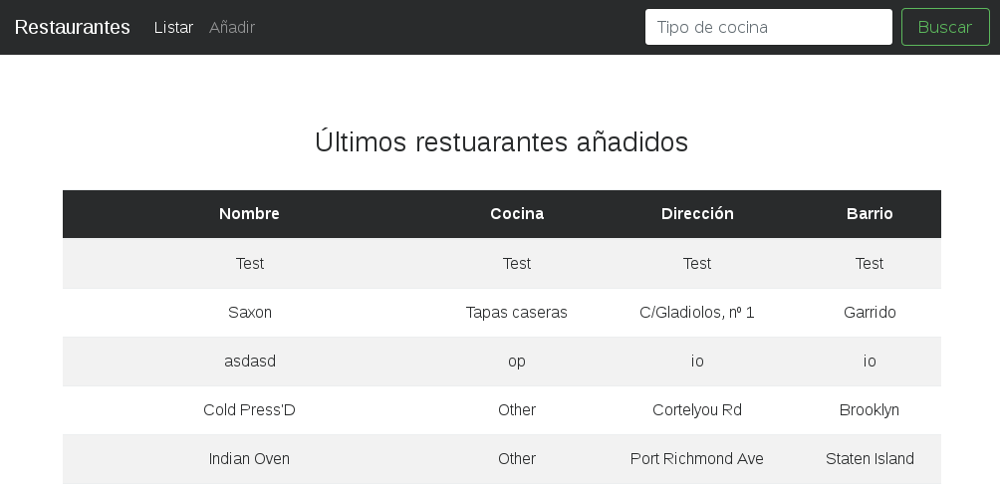
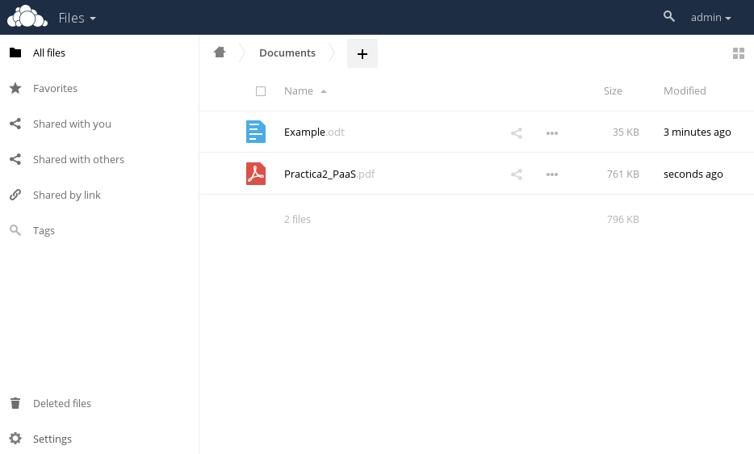

<div class="portada">

# Práctica 2: PaaS

<div class="portada-middle">

## Cloud Computing: Servicios y Aplicaciones
## Departamento de Ciencias de la Computación e Inteligencia Artificial
## Universidad de Granada


</div>
<div class="portada-down">

> Aythami Estévez Olivas <aythae@correo.ugr.es>

</div>
</div>

<!-- Salto de página -->
<div style="page-break-before: always;"></div>

## Tabla de contenidos

<!-- toc -->

- [Enunciado de la práctica](#enunciado-de-la-practica)
- [Descripción general del despliegue de un contenedor en docker](#descripcion-general-del-despliegue-de-un-contenedor-en-docker)
- [Configuración del servicio Web en docker](#configuracion-del-servicio-web-en-docker)
  * [Servidor web](#servidor-web)
  * [Servidor de aplicación](#servidor-de-aplicacion)
- [Configuración del SGBD en docker](#configuracion-del-sgbd-en-docker)
- [Descripción de la aplicación web. Objetivo, funcionalidad, arquitectura software, base de datos, tablas](#descripcion-de-la-aplicacion-web-objetivo-funcionalidad-arquitectura-software-base-de-datos-tablas)
- [Análisis de la funcionalidad de los contenedores replicados](#analisis-de-la-funcionalidad-de-los-contenedores-replicados)
- [Configuración de OwnCloud en docker](#configuracion-de-owncloud-en-docker)
- [Bibliografía](#bibliografia)

<!-- tocstop -->

<!-- Salto de página -->
<div style="page-break-before: always;"></div>

## Enunciado de la práctica
El objetivo de esta segunda práctica es familiarizarse con el uso de una plataforma PaaS usando para ello el despliegue de contenedores y la configuración de aplicaciones en estos.

Las tareas a realizar son:
1. Crear un contenedor docker (A) con un servidor web
2. Crear un contenedor docker (B) con un SGBD
3. Crear una aplicación desplegada en el contenedor A que utilice el SGBD desplegado en el contenedor B
4. Duplicar los contenedores A y B y discutir o mostrar que pasaría si uno de ellos cayese
5. Desplegar el servicio de OwnCloud en otro contenedor y chequear su funcionamiento
6. Elaborar un breve documento detallando todo el trabajo realizado


## Descripción general del despliegue de un contenedor en docker
Docker es una herramienta que permite la virtualización ligera usando contenedores, los cuales son instancias que contienen el sistema de ficheros con todo lo necesario para hacer funcionar el software empaquetado en ellos: código fuente, librerías, utilidades del sistema... haciendo que con esto se garantice que el software siempre se ejecute como se espera independientemente del entorno[[1]](#1).

Los contenedores en docker son instancias de **imágenes** creadas mediante un fichero de especificación o `Dockerfile`[[2]](#2) en el que se determina que pasos hay que llevar a cabo para crear la imagen (instalaciones de software, ficheros que debe de contener...).

Es posible descargar imágenes ya preparadas por otros usuarios de plataformas como [Docker Hub](https://hub.docker.com/), para llevar a cabo esta tarea basta con buscar la imagen deseada y ejecutar el comando
```
docker pull NombreImagen
```

Si en lugar de esto queremos crear una imagen a partir de alguna existente con cierta configuración posterior hay que crear un fichero `Dockerfile` y "construir" la imagen a partir de este con el comando
```
docker build -t tag  Path/to/Folder
```
donde `tag` es un nombre o identificador de la imagen y la ruta que le especificamos contiene un fichero Dockerfile con ese nombre, así como los ficheros que requiera este. Esta opción es por la que me he decantado ya que permite controlar exactamente las acciones llevadas a cabo en el contenedor para que esté operativo, así como replicar el proceso de creación del contenedor con apenas un par de comandos.

Para **instanciar un contenedor** a partir de una imagen hay que utilizar el comando
```
docker run [OPTIONS] IMAGE [COMMAND]
```
donde entre las **opciones** destacaré las que he utilizado:
- `-d`: Ejecuta el contenedor en segundo plano e imprime su ID.
- `-p <hostPort>:<containerPort>`: Publica un puerto del contenedor al host asociándolo a uno de este.
- `--link CONTAINER2`: Añade un enlace entre este contenedor y el CONTAINER2 haciendo que este se pueda comunicar con el otro usando su nombre como si de un nombre de dominio se tratase.
- `-i`: Mantiene la salida estándar abierta aunque el contenedor esté en segundo plano, se utiliza para ejecutar comandos en modo interactivo.
- `-t`: Crea un pseudo-TTY para conectarse al contenedor con una sesión de usuario en su CLI, se utiliza para ejecutar comandos en modo interactivo.

El **comando** a especificar permite ejecutar un comando concreto en el contenedor, es habitual que las imágenes creadas ya dispongan de un comando por defecto a ejecutar si no se especifica ninguno al instanciar el contenedor, son particularmente útiles los comandos que permiten ejecutar un interprete de linea de orden como `/bin/bash` o `/bin/sh` ya que con ellos junto con las opciones `-it` podemos acceder a un contenedor de forma interactiva.

Para completar esta introducción general de docker caben destacar los comandos:
- `docker exec [OPTIONS] CONTAINER COMMAND`: Permite ejecutar un comando en un contenedor en ejecución.
- `docker stop CONTAINER`: Permite detener un contenedor en ejecución.
- `docker start CONTAINER`: Permite arrancar un contenedor en detenido.
- `docker restart CONTAINER`: Permite reiniciar un contenedor en ejecución.
- `docker rm CONTAINER`: Permite borrar un contenedor detenido.
- `docker rmi IMAGE`: Permite borrar una imagen sin contenedores en ejecución.

## Configuración del servicio Web en docker
Como aplicación web a desplegar se usará la aplicación web de restaurantes utilizada en la práctica uno[[3]](#3), esta aplicación ha sido desarrollada en Python utilizando el framework Django. Este framework incluye un servidor para las aplicaciones pero no es recomendable usarlo ya que está pensado para desarrollo no para producción, por ello se recomienda utilizar un servidor web robusto y maduro como Nginx o Apache para actuar como proxy inverso que redirija peticiones al servidor de Django y se encargue de otras tareas como servir los ficheros estáticos o balancear la carga entre los diversos servidores de aplicación. Para comunicarse con el servidor de Django utilizaré el protocolo WSGI en su implementación uWSGI como ya hice en la primera práctica siguiendo las instrucciones oficiales[[4]](#4).

Por ello me planteé crear dos contenedores separados, uno para el servidor de aplicación con Django + uWSGI y otro con el servidor web propiamente dicho (Nginx). Esto ofrece diversas ventajas como gestionar de manera independiente ambos contenedores, poder desplegarlos de manera distribuida o poder replicar el servidor de aplicación fácilmente simplemente levantando más contenedores de su tipo.

Por ello descargué dos imágenes como base de estos contenedores, la imagen oficial de Nginx 1.11.13 para Alpine Linux[[5]](#5) y la imagen oficial de python 3.4.6 para Alpine Linux[[6]](#6). He elegido las imágenes de Alpine Linux ya que este sistema operativo esta diseñado para contenedores haciendo que sea un sistema muy básico que apenas ocupe unos pocos MB en comparación con otras distribuciones Linux más tradicionales[[7]](#7).

### Servidor web
Para crear este contenedor he creado un Dockerfile como el siguiente:
```
FROM nginx:alpine
# Reference https://docs.docker.com/engine/reference/builder/#label
LABEL maintainer "AythaE <aythae@correo.ugr.es>"

COPY uwsgi.conf /etc/nginx/conf.d/

RUN apk update && apk upgrade \
    && mv /etc/nginx/conf.d/default.conf /etc/nginx/conf.d/default.conf.old


COPY *.css /home/app/static/css/

CMD ["nginx", "-g", "daemon off;"]
```

Que básicamente añade el fichero `uwsgi.conf` a Nginx para que sepa como comunicarse con el servidor de aplicación mediante el protocolo WSGI usando un socket web y además le incorpora los ficheros estáticos de la aplicación web para que se encargue de servirlos. Se puede apreciar que como comando por defecto a ejecutar al instanciar esta imagen simplemente se ejecuta el servidor Nginx.

El fichero de configuración de Nginx es de la siguiente forma:
```
#Bloque para conexión por uwsgi con la aplicación
server {
    #En que puerto tiene que escucha
    listen 80;

    #Cual es el nombre del servidor
    server_name hadoop.ugr.es;

    #Donde se encuentran los ficheros estáticos que servirá
    #directamente nginx sin mediación de Django
    location /static/ {
        root /home/app;
    }
    #El resto de las peticiones derivarlas al socket para que
    #Django se encargue
    location / {
        include /etc/nginx/uwsgi_params;
        uwsgi_read_timeout 1800;
        uwsgi_send_timeout 600;
        proxy_read_timeout 60s;
        uwsgi_pass python_aythae:8000;

    }
}
```
Donde **`python_aythae`** es el nombre del contenedor donde se encuentra desplegada la aplicación. Para que este contenedor pueda comunicarse con el de la aplicación es necesario unir el contenedor de aplicación a este con la opción `--link` al instanciar este contenedor.

Para construir una imagen a partir de este dockerfile es necesario pasar los ficheros contenidos en `Nginx container/` al servidor y ejecutar el comando
```
docker build -t nginx_aythae_img Nginx\ container/
```

Una vez construida la imagen se puede instanciar con
```
docker run -d --name nginx_aythae --link python_aythae -p 14030:80 nginx_aythae_img
```
asignándole al puerto 80 del contenedor el puerto 14030 del host (uno de mis puertos asignados).

### Servidor de aplicación
Este contenedor ha sido creado un partiendo del siguiente Dockerfile:
```
FROM python:3.4-alpine
# Reference https://docs.docker.com/engine/reference/builder/#label
LABEL maintainer "AythaE <aythae@correo.ugr.es>"

RUN apk update && apk upgrade \
    && apk add git gcc linux-headers musl-dev supervisor \
    && pip install pymongo==2.8 mongoengine django uwsgi \
    && git clone https://github.com/AythaE/SSBW.git /home/SSBW \
    && apk del git gcc linux-headers musl-dev

EXPOSE 8000

COPY models.py /home/SSBW/T4/app/restaurantes/
COPY settings.py /home/SSBW/T4/app/app/
COPY app.ini /home/SSBW/T4/uwsgi/
COPY supervisord.conf /etc/

CMD ["supervisord", "-n"]
```
El cual actualiza el contenedor, instala `git`, algunas dependencias de uWSGI y `supervisor`. Supervisor es un software encargado de ejecutar otras utilidades y asegurarse de que funcionan volviéndolas a lanzar en caso de fallo [[8]](#8), en este caso se utiliza para lanzar uWSGI. Tras esto se instalan las dependencias de la aplicación de restaurantes usando `pip`, se clona el repositorio de GitHub donde se encuentra la aplicación y se borran los paquetes instalados que ya no son necesarios. Acto seguido se "expone" o abre el puerto 8000 en el que se ejecutará uWSGI para que pueda recibir comunicación desde el exterior.

Por último se copian diversos archivos de configuración y se indica que el comando por defecto a ejecutar al instanciar el contenedor sea `supervisord`.

Los archivos de configuración son los siguientes:
- `models.py`: Sirve para que la aplicación de restaurantes sepa donde encontrar la base de datos.
    ```
    ...
    # Conectarse a la BD
    connect('test', host='mongo_aythae', port=27017)
    ...
    ```
- `settings.py`: Informa a la aplicación de que host deben poder ejecutarla.
    ```
    ...
    ALLOWED_HOSTS = ['hadoop.ugr.es']
    ...
    ```
- `app.ini`: Fichero de configuración de uWSGI que le indica todos los parámetros de su ejecución:
    ```
    [uwsgi]
    #Variables
    project = app
    base = /home/SSBW/T4

    #Directorio base del projecto
    chdir = %(base)/%(project)

    #Fichero WSGI de Django
    module = %(project).wsgi:application
    master = true
    #Número máximo de procesos
    processes = 5

    #Usuario que ejecutará el proceso
    uid = root
    #Especificar como uwsgi escuchara a las conexiones entrantes usando
    #un socket web
    socket = 0.0.0.0:8000
    chmod-socket = 660
    vacuum = true
    buffer-size = 65535
    ```
- `supervisord.conf`: Fichero de configuración de supervisor que le indica que programa ejecutar.
    ```
    ...
    [program:uwsgi]
    command= /usr/local/bin/uwsgi --ini /home/SSBW/T4/uwsgi/app.ini
    ...
    ```

Para construir la imagen a partir de este Dockerfile es necesario pasar los ficheros contenidos en `App container/` al servidor y ejecutar el comando
```
docker build -t python_aythae_img App\ container/
```

Una vez construida la imagen se puede instanciar con
```
docker run -d --name python_aythae --link mongo_aythae python_aythae_img
```
enlazando este contenedor al contenedor de base de datos que se llamará **`mongo_aythae`**.

## Configuración del SGBD en docker
Como SGBD he utilizado MongoDB al igual que en la práctica previa, para ello he partido de la imagen mvertes/alpine-mongo[[9]](#9), que proporciona la versión 3.2.10-r1 de MongoDB, como base para mi contenedor. He seleccionado esta en lugar de la oficial por que MongoDB no proporciona una imagen que utilice Alpine Linux y porque probando con las oficiales parecen no funcionar correctamente con la version de docker instalada en hadoop.ugr.es.

Al igual que en la práctica previa usaré una BD de ejemplo dada por MongoDB[[10]](#10).

La especificación de la imagen que he creado se encuentra en este Dockerfile:
```
FROM mvertes/alpine-mongo:latest
# Reference https://docs.docker.com/engine/reference/builder/#label
LABEL maintainer "AythaE <aythae@correo.ugr.es>"

RUN apk update && apk upgrade && apk add mongodb-tools wget \
    && wget https://raw.githubusercontent.com/mongodb/docs-assets/primer-dataset/primer-dataset.json --no-check-certificate -P /root

COPY mongodb /etc/conf.d/
COPY final_set_up.sh /root/

WORKDIR /root/

ENTRYPOINT [ "/root/run.sh" ]
CMD [ "mongod" ]
```
El cual actualiza el sistema del contenedor, instala las herramientas de MongoDB y `wget` para poder descargar e importar la BD inicial, copia al contenedor el fichero de configuración de Mongo así como un script creado por mí para ejecutar dentro del contenedor una vez instanciado. Como final establece que el comando por defecto sea la ejecución de MongoDB.

El fichero de configuración de Mongo `mongodb` permite que Mongo escuche por todas las interfaces de red en lugar de solo usar localhost como haría por defecto.

He tenido que crear el script `final_set_up.sh` para poder importar la BD en MongoDB ya que el comando inicial al instanciar el contenedor es arrancar el SGBD y no es posible importarla previamente al no estar lanzado el SGBD. Además de esto borra algunos elementos que ya no son necesarios para ahorrar espacio.
```
#!/bin/sh
mongoimport --db test --collection restaurants --drop --file /root/primer-dataset.json

apk del wget mongodb-tools

rm /root/primer-dataset.json

```

Para construir la imagen a partir de este Dockerfile es necesario pasar los ficheros contenidos en `MongoDB container/` al servidor y ejecutar el comando
```
docker build -t mongo_aythae_img MongoDB\ container/
```

Una vez construida la imagen se puede instanciar con
```
docker run -d --name mongo_aythae mongo_aythae_img
```

Tras esto como ya he comentado habrá que ejecutar el script `final_set_up.sh` como ya he comentado, esto se puede llevar a cabo con el comando
```
docker exec -it mongo_aythae /bin/sh ./final_set_up.sh
```

## Descripción de la aplicación web. Objetivo, funcionalidad, arquitectura software, base de datos, tablas
La arquitectura de la aplicación seguida al dividirla en tres contenedores se puede apreciar en el siguiente diagrama de despliegue.


La descripción de la aplicación web es idéntica a la de la práctica previa, pero volveré a comentarla por resulta necesario.

La aplicación web ha sido creada en la asignatura Sistemas Software Basados en la Web, esta aplicación pretende ser una presentación del framework Django demostrando su funcionamiento utilizando una BD de ejemplo dada por MongoDB[[10]](#10), dicha base de datos es una BD de restaurantes con diversos campos, en concreto la aplicación usa los campos:
- _Name_: corresponde al nombre del restaurante
- _Cuisine_: tipo de cocina
- _Address.street_: la calle donde se encuentra el restaurante
- _Borough_: barrio donde se encuentra el restaurante

A nivel funcional es un listado de restaurantes en el que se muestran los últimos restaurantes añadidos a la BD. Además de eso tiene la funcionalidad de buscar por tipo de cocina y de añadir nuevos restaurantes mediante un formulario.
Si la se han seguido todos los pasos de esta memoria la aplicación está disponible en la URL <http://hadoop.ugr.es:14030/restaurantes/>. El aspecto que tiene se puede apreciar en la siguiente imagen:



Tecnológicamente utiliza Python3, los módulos:
- Django (Framework para la creación de aplicaciones web)
- Mongoengine (ODM para MongoDB)
- uWSGI (Contenedor para la aplicación que sirve como interfaz de comunicación con Nginx)
- Para generar las vistas hace uso de HTML, Django template language (DTL), CSS y Bootstrap.


## Análisis de la funcionalidad de los contenedores replicados
Sobre la replicación de los los contenedores no se ha llevado a cabo directamente, pero se podrían duplicar cada uno de los 3 contenedores creados obteniendo las ventajas que esto conlleva como el incremento de la robustez, la escalabilidad... Resultaría interesante probar el sistema con algún tipo de balanceador de carga, como se planteó, que permita lanzar contenedores automáticamente según se vaya necesitando.

A falta de un sistema más automático se pueden obtener ciertas ventajas con la configuración actual del servidor, por ejemplo en el caso del contenedor de aplicación podría ser interesante tener múltiples instancias y utilizar el contenedor de Nginx como un balanceador de carga HTTP [[11]](#11) haciendo que en teoría se pudiera servir la aplicación a un número mayor de clientes y/o ofreciendo tiempos de respuesta menores que las mismas peticiones sobre un único servidor de aplicación. Esto además haría que el servicio fuera más robusto ya que en caso de caer una instancia del servidor de aplicación sería posible redirigir las peticiones a las restantes, teóricamente tambíen sería posible que una instancia del servidor de aplicación se volviera a relanzar sola si se produce un fallo que cierra uWSGI debido a software supervisord encargado de que se encuentre lanzado uWSGI.

Otro ejemplo de lo útil que resultaría la replicación sería en el caso de contenedor MongoDB, este SGBD permite la creación de conjuntos de replicas[[12]](#12), es decir BD con la misma información replicada lo cual incrementa la tolerancia a fallos, en caso de que una instancia caiga otra puede ocupar su lugar. Adicionalmente esto permitiría tener instancias de MongoDB separadas geográficamente que en caso de catástrofe permitiría no perder ningún dato si alguna de las instancias se salva.

## Configuración de OwnCloud en docker
Siguiendo el tutorial de los apuntes [[13]](#13) he desplegado un servicio OwnCloud partiendo la imagen oficial de OwnCloud en Docker Hub [[14]](#14) y de la imagen oficial de PostgreSQL [[15]](#15).

OwnCloud utiliza por defecto una BD SQLite, la cual no está recomendada para un entorno más o menos real, por ello utilizaré una BD PostgreSQL.

Para descargar la imagen de PostgreSQL ejecuto el comando:
```
docker pull postgres
```
Una vez descargada se puede instanciar usando
```
docker run --name owncloud-postgres_aythae -e POSTGRES_PASSWORD=mysecretpassword -d postgres
```
Fijando la contraseña mediante la variable de entorno `POSTGRES_PASSWORD`, notesé que se ha fijado una contraseña muy simple debido a que esto es una prueba, en un entorno real habría que fijar una contraseña más segura.

Ahora para descargar la imagen de OwnCloud:
```
docker pull owncloud
```

y para instanciar un contenedor con ella y enlazarlo a la BD:
```
docker run -d --link owncloud-postgres_aythae:owncloud-db --name owncloud_aythae -p 14031:80 owncloud
```

Una vez estén los dos contenedores desplegados podemos configurar el servicio accediendo a <http://hadoop.ugr.es:14031/>. Se piden rellenar unos pocos datos para crear un usuario administrador y configurar la BD. Los datos introducidos son:
> - User: admin
> - Pass: admin
> - Storage & Database
>   - Data folder: /var/www/html/data
>   - Database: PostgreSQL
>   - Database user: postgres
>   - Database pass: mysecretpassword
>   - Database name: postgres
>   - Database host: owncloud-db

Con esto ya tenemos un servicio de OwnCloud desplegado y operativo pudiendo utilizarlo para subir archivos como nube personal.




<!-- Salto de página -->
<div style="page-break-before: always;"></div>

## Bibliografía

<p id="1">

[1]: What is docker?, consultado en 04/2017, <https://github.com/manuparra/MasterDegreeCC_Practice/blob/master/starting_docker.md#what-is-docker>

</p>
<p id="2">

[2]: Dockerfile reference, consultado en 04/2017, <https://docs.docker.com/engine/reference/builder/>

</p>

<p id="3">

[3]: A. Estévez (2017), Práctica 1: IaaS, Cloud Computing: Servicios y Aplicaciones.

</p>

<p id="4">

[4]: uWSGI, Setting up Django and your web server with uWSGI and nginx, consultado en 04/2017, <http://uwsgi-docs.readthedocs.io/en/latest/tutorials/Django_and_nginx.html>

</p>

<p id="5">

[5]: Nginx official repository, Docker Hub. consultado en 04/2017, <https://hub.docker.com/_/nginx/>

</p>


<p id="6">

[6]: python official repository, Docker Hub. consultado en 04/2017, <https://hub.docker.com/_/python/>

</p>

<p id="7">

[7]: Alpine Linux, consultado en 04/2017, <https://alpinelinux.org/>

</p>

<p id="8">

[8]: Supervisor 3.3.1, Introduction, consultado en 04/2017, <http://supervisord.org/introduction.html>

</p>

<p id="9">

[9]: mvertes, alpine-mongo, consultado en 04/2017, <https://hub.docker.com/r/mvertes/alpine-mongo/>

</p>

<p id="10">

[10]: MongoDB, Import example dataset, consultado en 04/2017, <https://docs.mongodb.com/getting-started/shell/import-data/>

</p>

<p id="11">

[11]: Using nginx as HTTP load balancer, consultado en 04/2017, <http://nginx.org/en/docs/http/load_balancing.html>

</p>

<p id="12">

[12]: MongoDB, Replication, consultado en 04/2017, <https://docs.mongodb.com/manual/replication/>

</p>

<p id="13">

[13]: Setting up an ownCloud Server in a Docker container using Docker Compose, consultado en 04/2017, <http://blog.securem.eu/serverside/2015/08/25/setting-up-owncloud-server-in-a-docker-container/>

</p>

<p id="14">

[14]: OwnCloud official repository, consultado en 04/2017, <https://hub.docker.com/_/owncloud/>

</p>

<p id="15">

[15]: PostgreSQL official repository, consultado en 04/2017, <https://hub.docker.com/_/postgres/>

</p>
